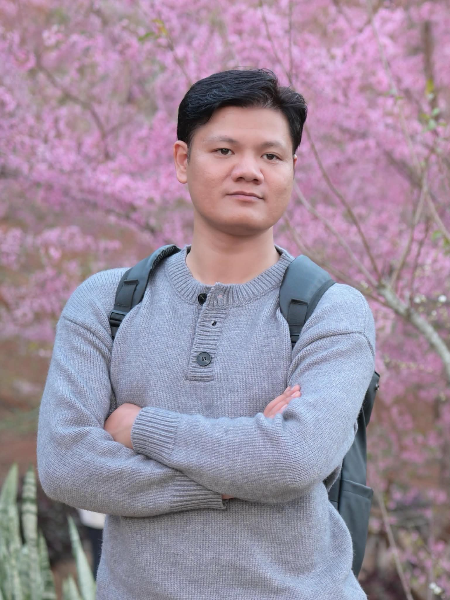

# CURRICULUM VITAE - NGUYỄN ĐỨC PHÚC
**CHUYÊN VIÊN PHÁT TRIỂN PHẦN MỀM / TECHNICAL LEADER**

* **Địa chỉ**: Hà Nội, Việt Nam  
* **Điện thoại**: 0364.252.470  
* **Email**: phucnd.work@gmail.com  
* **Ngày sinh**: 06/04/1991 (Nam)  
* **Thể chất**: Chiều cao: 180 cm | Cân nặng: 80 kg (Sức khỏe tốt, ngoại hình cân đối)  

---

## TÓM TẮT NĂNG LỰC CHUYÊN MÔN

* **10+ Năm Kinh Nghiệm Chuyên Sâu**: Chuyên gia Phát triển Phần mềm & Leader kỹ thuật với hơn 10 năm kinh nghiệm thực chiến trong việc phân tích, thiết kế, phát triển và triển khai các hệ thống phần mềm quy mô lớn trên nền tảng Mobile & Web.
* **Am Hiểu Nghiệp Vụ Tài Chính - Ngân Hàng - Bảo Hiểm**: Trực tiếp xây dựng các hệ thống tài chính yêu cầu độ bảo mật cao: Chuyển tiền quốc tế (FinBlue UK-VN), eKYC xác thực sinh trắc học AI cho Ngân hàng, Ứng dụng bảo hiểm số tích hợp CSDL tập trung Oracle (Tập đoàn Bảo Việt), và các nền tảng FinTech/Blockchain.
* **Cơ Sở Dữ Liệu & Tối Ưu Truy Vấn SQL**: Nắm vững kiến thức CSDL, thành thạo thiết kế và tối ưu hóa truy vấn SQL (Oracle, PostgreSQL, MySQL, SQLite, Realm DB), đảm bảo hiệu năng xử lý dữ liệu và xuất báo cáo nghiệp vụ tốc độ cao.
* **Quy Trình SDLC, Docker & CI/CD Pipelines**: Nắm vững quy trình SDLC (Agile/Scrum), quản lý mã nguồn GitFlow, thiết kế kiểm thử Unit Test, cùng kinh nghiệm đóng gói container (Docker) và tự động hóa chuỗi triển khai (CI/CD pipelines).
* **Lãnh Đạo & Đào Tạo Đội Ngũ**: Khả năng phân tích yêu cầu nghiệp vụ chuyên sâu cùng BA/QA/PM, làm rõ API contract; từng đảm nhận vai trò Mentor xuất sắc, xây dựng, đào tạo và phát triển đội ngũ lập trình viên từ quy mô nhỏ tới lớn.

---

## GIẢI THƯỞNG & THÀNH TỰU CÁ NHÂN

* **Nhân viên xuất sắc năm 2021** — Công ty TEADAO *(Ghi nhận đóng góp xuất sắc trong phát triển hệ thống FinTech & Blockchain)*.
* **Mentor xuất sắc năm 2020** — Công ty Rikkeisoft *(Thành tích nổi bật trong công tác tuyển dụng, đào tạo & xây dựng Đội ngũ Mobile)*.
* **Nhân viên xuất sắc năm 2018** — Công ty Rikkeisoft *(Ghi nhận chất lượng bàn giao dự án cao và tinh thần trách nhiệm vượt trội)*.
* **Nhân viên mới xuất sắc năm 2015** — Công ty Rikkeisoft *(Ghi nhận sự bứt phá và đóng góp tích cực ngay trong năm đầu tiên gia nhập)*.

---

## KỸ NĂNG KỸ THUẬT CỐT LÕI

* **Nghiệp Vụ & Kiến Trúc**: Chứng Khoán & Tài Chính, FinTech & eKYC, System Architecture, Clean Architecture, MVVM, Microservices, SDLC, Agile / Scrum.
* **Cơ Sở Dữ Liệu & SQL**: Oracle SQL, PostgreSQL, MySQL, SQLite, CoreData, Realm DB, Query Optimization.
* **Ngôn Ngữ & Nền Tảng**: Swift / SwiftUI, Flutter (Dart), Objective-C, Kotlin, Java, RxSwift, RESTful APIs, WebSockets.
* **DevOps, Tools & Kiểm Thử**: Docker, CI / CD Pipelines, Git / GitFlow, Unit Testing, Fastlane, Firebase, Technical Docs.

---

## KINH NGHIỆM LÀM VIỆC CHI TIẾT

### **CÔNG TY NEOS VIỆT NAM (NEOS VIETNAM INTERNATIONAL CO., LTD)**
*Vị trí*: **iOS Technical Leader** | *Thời gian*: 03/2025 – Hiện tại
* **Phát triển & Kiến trúc**: Chủ trì kỹ thuật xây dựng ứng dụng hệ sinh thái *Calomama Plus* dựa trên kiến trúc SwiftUI và MVVM, đảm bảo tính mở rộng và dễ bảo trì.
* **Phân tích Nghiệp vụ & API Contract**: Trực tiếp phối hợp với BA và Backend Team để làm rõ bài toán nghiệp vụ, thống nhất API contracts và cấu trúc CSDL.
* **Kiểm thử & Đóng gói**: Duyệt Code Review, thiết kế Unit Test, quản lý phiên bản mã nguồn GitFlow và kiểm soát luồng đóng gói triển khai ứng dụng.
* **Quản lý & Báo cáo**: Ước lượng khối lượng công việc (estimation), phân chia nhiệm vụ Sprint, hướng dẫn lập trình viên và báo cáo tiến độ trực tiếp tới Ban giám đốc.

---

### **FPT SOFTWARE**
*Vị trí*: **Senior Mobile Developer / Software Engineer** | *Thời gian*: 08/2023 – 03/2025
* **Phát triển Phần mềm Doanh nghiệp**: Xây dựng các module phần mềm phức tạp cho các dự án quy mô lớn, tuân thủ nghiêm ngặt chuẩn kiến trúc và bảo mật.
* **Quy trình SDLC & UAT**: Thực hiện phân tích thiết kế, viết mã nguồn, Unit Test và phối hợp chặt chẽ với QA/BA trong công tác kiểm thử tích hợp & UAT trước khi nghiệm thu.
* **Tự động hóa CI/CD**: Cấu hình quy trình đóng gói phần mềm và quản lý phiên bản Git/CI-CD, giúp giảm 30% thời gian đóng gói và bàn giao.

---

### **FINBLUE / CÔNG TY HLP**
*Vị trí*: **Senior FinTech Developer** | *Thời gian*: 09/2022 – 08/2023
* **Hệ thống Chuyển tiền Quốc tế**: Phát triển ứng dụng FinTech đa nền tảng phục vụ giao dịch chuyển tiền trực tuyến Anh - Việt Nam bảo mật cao.
* **Bảo mật & Tối ưu CSDL**: Áp dụng mã hóa giao dịch end-to-end, xác thực sinh trắc học; thiết kế CSDL local (SQLite/Realm) và tối ưu truy vấn SQL giúp tra cứu lịch sử giao dịch tức thì.

---

### **CÔNG TY TEADAO / TNT SOLUTION**
*Vị trí*: **Mobile Team Leader** | *Thời gian*: 01/2022 – 09/2022
* **Vinh danh**: Đạt danh hiệu **Nhân viên xuất sắc năm 2021 tại TEADAO**.
* **Quản lý & Phát triển**: Quản lý kỹ thuật và trực tiếp thiết kế các ứng dụng tài chính phi tập trung (DeFi), FinTech và Blockchain.
* **Đào tạo & Chuẩn hóa**: Quản lý team 8 nhân sự; xây dựng tài liệu kiến trúc mẫu, chuẩn hóa quy trình GitFlow và tự động hóa CI/CD.

---

### **CÔNG TY RIKKEISOFT (RIKKEISOFT COMPANY)**
*Vị trí*: **Mobile Team Leader / iOS Technical Leader / Senior Developer** | *Thời gian*: 03/2014 – 12/2021 *(7+ Năm cống hiến)*
* **Vinh danh & Giải thưởng**: **Mentor xuất sắc 2020** *(Thành tích đào tạo & xây dựng đội ngũ)* | **Nhân viên xuất sắc 2018** | **Nhân viên mới xuất sắc 2015**.
* **Đào tạo & Xây dựng Đội ngũ (2019 – 2021)**: Trực tiếp tham gia công tác tuyển dụng, xây dựng chương trình đào tạo lập trình viên mobile mới, xây dựng Đội ngũ Mobile Rikkeisoft phát triển số lượng và chất lượng vượt bậc.
* **Module eKYC Ngân hàng (2020 – 2021)**: Chủ trì kỹ thuật xây dựng ứng dụng eKYC tích hợp module AI quét giấy tờ (OCR), nhận diện khuôn mặt và ghi hình luồng xác thực bảo mật cho Ngân hàng.
* **Hệ thống Chat Doanh nghiệp IM (2019 – 2020)**: Thiết kế ứng dụng truyền thông nội bộ mã hóa đầu cuối E2EE, WebSockets real-time, CallKit và Push Notifications phục vụ 10.000+ người dùng.
* **Dự án Quốc tế (2014 – 2018)**: Lãnh đạo & hoàn thành 10+ dự án lớn cho thị trường Nhật/Anh (Inploi tích hợp thanh toán Stripe, Favor E-commerce, Live 3s tin thể thao thời gian thực, TokyoParksNavi ứng dụng du lịch định vị GPS/Beacon).

---

### **TẬP ĐOÀN BẢO VIỆT (BAOVIET HOLDINGS)**
*Vị trí*: **iOS Software Engineer** | *Thời gian*: 03/2018 – 03/2019
* **Ứng dụng Bảo hiểm Số**: Trực tiếp phát triển ứng dụng quản lý bảo hiểm cho khách hàng doanh nghiệp và cá nhân.
* **Tích hợp CSDL Tập trung**: Lập trình kết nối dữ liệu hợp đồng bảo hiểm, bồi thường với CSDL tập trung Oracle SQL của tập đoàn.

---

## DỰ ÁN TIÊU BIỂU BẰNG CHỨNG NĂNG LỰC

| Tên Dự Án | Lĩnh Vực & Vai Trò | Công Nghệ Sử Dụng | Đóng Góp Cốt Lõi & Kết Quả |
| :--- | :--- | :--- | :--- |
| **Bảo Hiểm Bảo Việt** | Bảo Hiểm / Tài Chính *Software Engineer* | Swift, Oracle SQL, Alamofire, CoreData | Số hóa quy trình bồi thường & quản lý hợp đồng kết nối CSDL tập trung Oracle. |
| **FinBlue Remittance** | FinTech / Chuyển tiền *Senior Developer* | Flutter, Dart, SQLite, Encryption, REST | Xây dựng ứng dụng chuyển tiền Anh - VN bảo mật tuyệt đối, tra cứu lịch sử tức thì. |
| **Banking eKYC Module** | Bảo mật / Ngân hàng *Technical Lead* | Flutter, iOS/Android, AI OCR, Live Video | Tự động hóa xác thực sinh trắc học & lưu trữ bằng chứng kiểm toán cho Ngân hàng. |
| **IM Chat Platform** | Truyền thông Doanh nghiệp *Technical Lead* | iOS Native, WebSockets, E2EE, CallKit | Hệ thống chat nội bộ mã hóa đầu cuối chịu tải 10.000+ người dùng không độ trễ. |
| **Inploi Recruitment** | E-Commerce / HR *Project Leader* | Swift, Realm DB, Stripe API, APNS Push | Thuật toán ghép nối ứng viên thông minh tích hợp thanh toán tự động qua Stripe. |

---

## HỌC VẤN & GIẢI THƯỞNG KHÁC

* **Đại Học FPT (FPT University)** — Kỹ Sư Phần Mềm (Software Engineering) *(2010 – 2014)*
  * Nền tảng vững chắc về Cấu trúc dữ liệu & Thuật toán, Hệ quản trị CSDL (DBMS), Kiến trúc phần mềm & SDLC. GPA: 7.0 / 10.
* **Hackathon Windows 8 (2013)**: Thành viên đội thi đạt giải Vòng Chung kết.

---

## THÔNG TIN BỔ SUNG

* **Ngoại ngữ**: Tiếng Việt (Tiếng mẹ đẻ), Tiếng Anh (Đọc hiểu tài liệu kỹ thuật, giao tiếp công việc thành thạo).
* **Phong cách làm việc**: Sức khỏe tốt, tinh thần trách nhiệm cao, chủ động giải quyết vấn đề kỹ thuật khó, hòa đồng và sẵn sàng chia sẻ kiến thức với đồng nghiệp.
